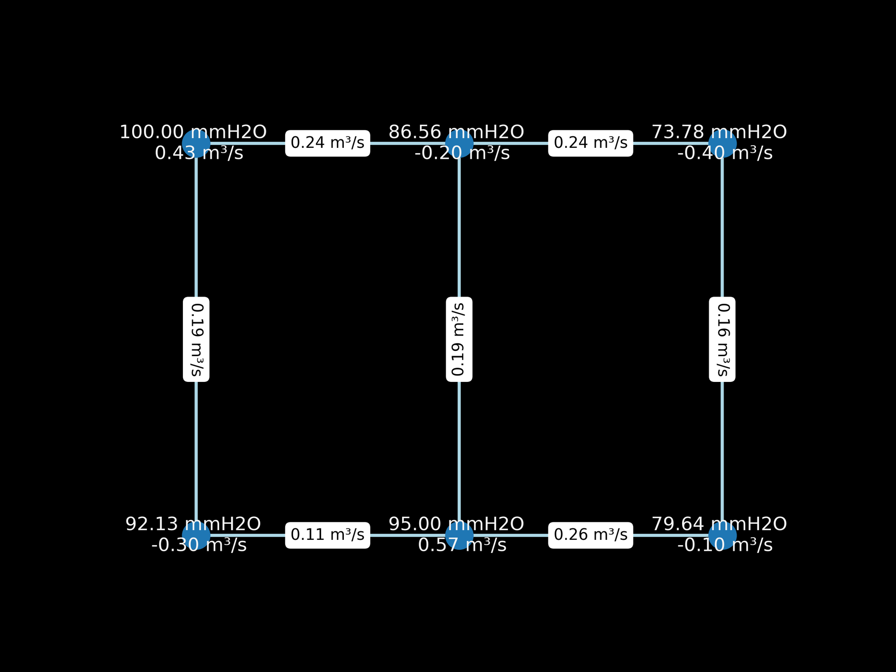

# Projet Conduits Newton-Raphson
Code cree pour la resolution du projet de GCH2545

Le fichier [conduite_analyse](conduits_analyse.py) est util pour tester le code

## User interface
Une interface utilisateur a été crée afin de faciliter la création et la visualization des réseaux. Il suffit d'executer le fichier [conduits_gui.py](conduits_gui.py) pour l'utiliser.

